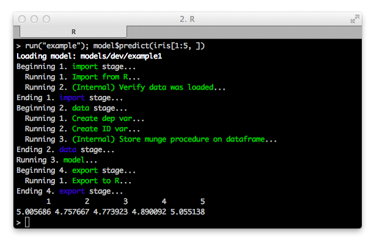

[Syberia](http://syberia.io) [](https://travis-ci.org/syberia/syberia) [](https://coveralls.io/r/syberia/syberia) [](http://syberia.io/docs) [](http://syberia.github.io/syberia/) [](https://gitter.im/syberia/Lobby)
===========

*Announcement*: If you're here from the R / Finance 2017 conference, 
[head over here](https://github.com/robertzk/rfinance17).

Syberia is the development framework for R.

Syberia was developed at [Avant](https://github.com/avantcredit) to
serve as the framework for developing and deploying machine learning models.
The goal was to develop a modeling engine capable of solving academic,
research and business problems that require use of statistical methods.

[The modeling grammar](http://github.com/syberia/modeling.sy),
currently the main significant engine built in Syberia, is a
framework for building, debugging, testing, and deploying classifiers developed in R.
It provides an opinionated unified framework for fast iteration on model  
development and deployment. It has modularity and testability built in
as a design assumption, is founded on convention-over-configuration,
and aims to solve the problems of classifier-specific data preparation and
classifier-specific modeling parameters.

The more general vision for Syberia is still in progress but aims
to bring unity to the currently disparate realms of the R development ecosystem.
In the viewpoint of the author, R is syntactic sugar around LISP, which enables arbitrary computation;
Syberia is an attempt to support this conjecture by allowing the
construction of arbitrary software projects within the R programming language,
thereby finally outgrowing its long-overdue misconception as a statistical tool.

The timeline for future engines and information about how
to contribute is listed at the [Syberia roadmap](http://syberia.io/roadmap).

## Installation

To get started right away, try out the minimal
[example syberia project](https://github.com/syberia/example.sy):

```
# Run this from your command line terminal.
git clone git@github.com:syberia/example.sy.git && cd example.sy && R
```

This will open an R console (installing dependencies for the first time may take a while;
for troubleshooting see the [troubleshooting guide](http://syberia.io/trouble)).
You can then type:

```r
run("example1")
model$predict(iris[1:5, ]) # The first five scores from a trained classifier.
# [1] 5.005686 4.757667 4.773923 4.890092 5.055138
```

For more detailed instructions, see the [installation guide](http://syberia.io/docs).



## Packages

Syberia relies on the following supplemental packages:

| Name | Status |
| ---- | -----  |
| [**Mungebits2**](https://github.com/syberia/mungebits2) | [](https://travis-ci.org/syberia/mungebits2) [](https://coveralls.io/r/syberia/mungebits2) [](http://syberia.github.io/mungebits2/) |
| [**Stagerunner**](https://github.com/syberia/stagerunner) | [](https://travis-ci.org/syberia/stagerunner) [](https://coveralls.io/r/syberia/stagerunner) [](http://syberia.github.io/stagerunner/) |
| [**Tundra**](https://github.com/syberia/tundra) | [](https://travis-ci.org/syberia/tundra) [](https://coveralls.io/r/syberia/tundra) [](http://syberia.github.io/tundra/)  |
| [**Director**](https://github.com/syberia/director) | [](https://travis-ci.org/syberia/director) [](https://coveralls.io/r/syberia/director/badge.png) [](http://syberia.github.io/director/) |

Additional packages used internally at [Avant](https://github.com/avantcredit)
in conjunction with Syberia modeling projects include
[batchman](https://github.com/peterhurford/batchman),
[bettertrace](https://github.com/robertzk/bettertrace),
[cachemeifyoucan](https://github.com/robertzk/cachemeifyoucan),
[dokk](https://github.com/kirillseva/dokk),
[lockbox](https://github.com/robertzk/lockbox),
[microserver](https://github.com/robertzk/microserver),
[objectdiff](https://github.com/robertzk/objectdiff),
[Ramd](https://github.com/robertzk/Ramd),
[rocco](https://github.com/robertzk/rocco),
[s3mpi](https://github.com/robertzk/s3mpi),
[testthatsomemore](https://github.com/robertzk/testthatsomemore), and
[treeskeleton](https://github.com/robertzk/treeskeleton).

### Development

To run the tests for the Syberia package, you will have to check
out its git submodules.

```
git submodule update --init --recursive
```

This will pull in `inst/engines/base.sy` from the [base engine](http://github.com/syberia/base.sy).

### License

This project is licensed under the MIT License:

Copyright (c) 2014-2017 Robert Krzyzanowski

Permission is hereby granted, free of charge, to any person obtaining
a copy of this software and associated documentation files (the
"Software"), to deal in the Software without restriction, including
without limitation the rights to use, copy, modify, merge, publish,
distribute, sublicense, and/or sell copies of the Software, and to
permit persons to whom the Software is furnished to do so, subject to
the following conditions:

The above copyright notice and this permission notice shall be included
in all copies or substantial portions of the Software.

THE SOFTWARE IS PROVIDED "AS IS", WITHOUT WARRANTY OF ANY KIND,
EXPRESS OR IMPLIED, INCLUDING BUT NOT LIMITED TO THE WARRANTIES OF
MERCHANTABILITY, FITNESS FOR A PARTICULAR PURPOSE AND NONINFRINGEMENT.
IN NO EVENT SHALL THE AUTHORS OR COPYRIGHT HOLDERS BE LIABLE FOR ANY
CLAIM, DAMAGES OR OTHER LIABILITY, WHETHER IN AN ACTION OF CONTRACT,
TORT OR OTHERWISE, ARISING FROM, OUT OF OR IN CONNECTION WITH THE
SOFTWARE OR THE USE OR OTHER DEALINGS IN THE SOFTWARE.

### Authors

Syberia was originally created at [Avant](https://github.com/avantcredit)
by Robert Krzyzanowski, rob@robertzk.com. Additional contributors
include Peter Hurford, Kirill Sevastyanenko, Tong Lu, Abel Castillo, and others.

